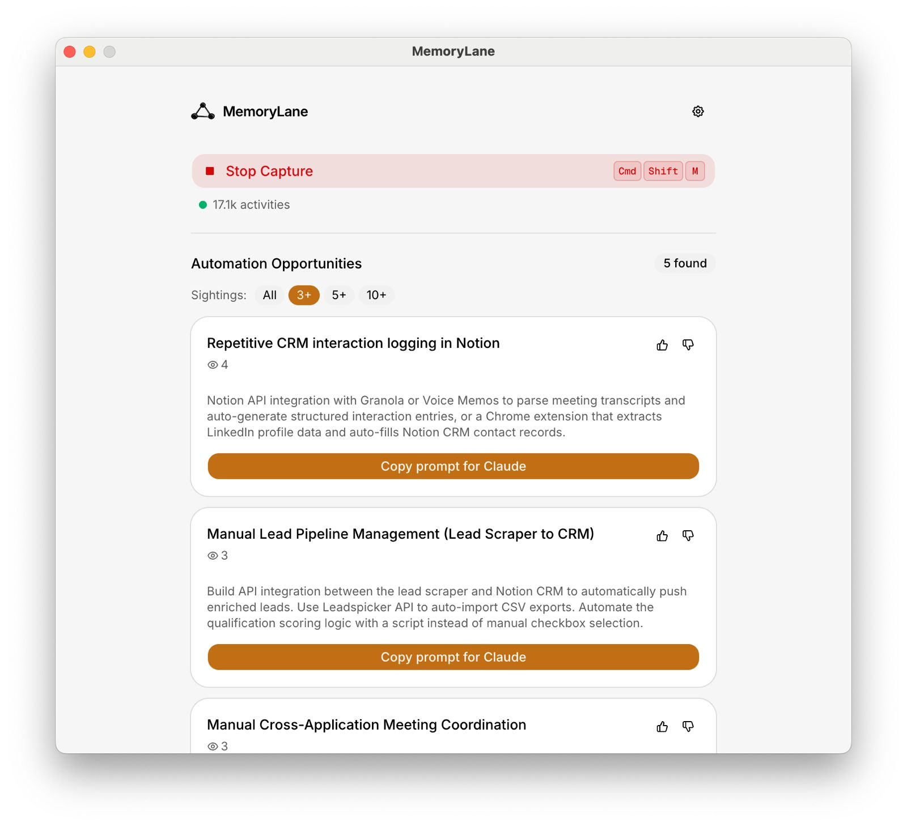

# MemoryLane

[](https://discord.gg/qVbEWnNf)

## Installation

### macOS (Apple Silicon)

```bash
curl -fsSL https://raw.githubusercontent.com/deusXmachina-dev/memorylane/main/install.sh | sh
```

This downloads the latest release and installs it to `/Applications`.

### Windows (Preview)

1. Download the latest `MemoryLane Setup *.exe` from [GitHub Releases](https://github.com/deusXmachina-dev/memorylane/releases).
2. Run the installer and finish setup.
3. Launch MemoryLane from the Start menu.

## TL;DR

Desktop app that sees what you see, stores summaries about it locally and lets you query it in any AI chat via MCP.

**Screenshots → local storage → MCP into AI chats**

🎬 [Demo](https://www.youtube.com/watch?v=MU7S3FHHlr8)

<p align="center">
  
  
  
</p>

### Example queries

Once connected, try asking your AI assistant things like:

- "What was I working on this morning?"
- "Pick up where I left off on the auth refactor"
- "Summarize my research on **\_** from last week"
- "List the design frameworks I looked at recently"
- "When did I last review PR #142?"

## Privacy & Permissions

MemoryLane captures your screen to give AI assistants context about what you're working on. Here's what that means in plain terms:

- **Screen Recording** — the app takes screenshots of your display. macOS will ask you to grant Screen Recording permission. This means the app can see everything on your screen while capture is running.
- **Accessibility** — the app monitors keyboard and mouse activity (clicks, typing sessions, scrolling) to decide _when_ to capture. macOS will ask you to grant Accessibility permission. The app does not log keystrokes.
- **What happens to screenshots** — each screenshot is sent to your configured model endpoint for summarization and OCR (OpenRouter by default, or a custom endpoint such as local Ollama). The screenshot is then deleted.
- **What is stored** — only short text summaries and OCR extracts are kept, in a local SQLite database on your machine. Nothing leaves your device except the screenshot sent for processing.
- **Endpoint credentials** — by default, the app uses [OpenRouter](https://openrouter.ai/) and needs API credentials. You have two built-in options:
  - **Get a managed key ($10/month)** _(recommended)_ — pay a monthly fee and we provision an OpenRouter API key for you. No OpenRouter account needed. The key is a real OpenRouter key tied to your device — MemoryLane does **not** proxy your requests. Your screenshots go directly from your machine to OpenRouter. We only handle key provisioning and billing.
  - **Bring Your Own Key** — already have an OpenRouter account? Paste your own API key instead. You pay OpenRouter directly and have full control over your account, usage limits, and billing.
  - You can also configure a custom OpenAI-compatible endpoint (for example a local Ollama server), including its own auth header if needed.
  - Any saved secret is encrypted and stored locally using Electron's safeStorage.

> **Bottom line:** you are giving this app permission to see your screen and detect your input. All captured data is processed into text and stored locally. Screenshots are sent directly from your machine to the configured model endpoint (OpenRouter by default, or your custom provider). MemoryLane never proxies your capture payloads.

## Current Status

> **⚠️ Early release**
>
> This is a fully functional early release. Expect rough edges.

### What works today

- Event-driven screen capture (typing, clicking, scrolling, app switches, visual changes)
- Launch at login
- OCR via macOS Vision framework and native Windows OCR
- AI-powered activity summarization (Mistral Small, GPT-5 Nano, Grok-4.1 Fast, Gemini Flash Lite via OpenRouter)
- Custom endpoint support for OpenAI-compatible providers (including local models like Ollama)
- Semantic + full-text search over your activity history
- MCP server with `search_context`, `browse_timeline`, and `get_event_details` tools
- One-click integration with Claude Desktop, Claude Code, and Cursor
- Configurable capture settings and API usage tracking

## Usage

### Requirements

- macOS (Apple Silicon / ARM64)
- A configured model endpoint:
  - Managed MemoryLane key ($10/month), **or**
  - your own [OpenRouter](https://openrouter.ai/) API key, **or**
  - a custom OpenAI-compatible endpoint (for example local Ollama)

### First launch

1. Grant **Screen Recording** permission when prompted
2. Grant **Accessibility** permission when prompted
3. Choose your default model provider:
   - **Get API Key** _(recommended)_ — click Get API Key to get a managed key ($10/month via Stripe)
   - **Bring Your Own Key** — paste your OpenRouter API key if you already have one
4. Optional: configure a custom endpoint/model in settings if you want to use local or self-hosted models

### Start capturing

Click the MemoryLane icon in your menu bar and select **Start Capture**. The app will begin taking screenshots based on your activity — typing sessions, clicks, scrolling, app switches, and visual changes on screen. You can stop anytime from the same menu.

### Connect to an AI assistant

From the tray menu, click **Add to Claude Desktop**, **Add to Claude Code**, or **Add to Cursor**. This registers MemoryLane as an MCP server so your AI assistant can query your activity history.

You can also set it up manually by pointing your MCP client to the MemoryLane server binary.

When using MCP tools:

- Use event **summaries** to answer "what was I doing?" questions.
- Use **OCR text** only for exact recall (specific strings, file names, errors, or quotes).
- Avoid drawing activity conclusions from OCR alone, because OCR may include unrelated on-screen text.

## How It Works

AI conversations are full of friction because LLMs have no context about you. MemoryLane fixes that by watching what you do and making it searchable.

1. The app captures screenshots based on user activity triggers (not fixed intervals)
2. A configured vision model endpoint extracts a short summary and OCR text from each screenshot
3. The screenshot is deleted — only the text summary is stored locally in SQLite
4. Vector embeddings enable semantic search over your history
5. An MCP server exposes your history to AI assistants on demand

### Why cloud by default?

**Performance** — local models are ~4 GB and turn laptops into space heaters. We believe most users prefer speed and normal battery life from an invisible background app.

**Quality** — cloud models perform significantly better for summarization and OCR. Local models make a nice demo but fall short when users expect reliable output.

If you prefer local or self-hosted inference, you can now configure custom OpenAI-compatible endpoints (for example Ollama). Cloud remains the default path for most users because it is faster and typically more accurate.

## Build from Source

1. Clone this repo
2. `npm install`
3. `npm run dev` to start in development mode
4. See [CLAUDE.md](CLAUDE.md) for full development commands and architecture details

## Limitations

1. **Windows is preview support** — some OS-specific UX (permissions and tray behavior) may still require tuning.
2. **Windows OCR depends on native OCR availability** — if OCR language components are unavailable on a given Windows setup, OCR can fail while capture continues.
3. **Platform support is still evolving** — Linux and Intel macOS are not yet officially supported.

## Coming Soon

- **Browser integration** — deeper context from browser tabs and web apps
- **Managed cloud service** — hosted version with richer integrations, online LLM tool access, and zero setup
- **Cross-platform parity** — Intel Mac and Linux support, plus polished Windows UX

## Community

Questions, feedback, and feature ideas are welcome in our Discord server.

[Join the MemoryLane Discord](https://discord.gg/qVbEWnNf)

## Star History

[](https://www.star-history.com/#deusXmachina-dev/memorylane&type=date&legend=top-left)
