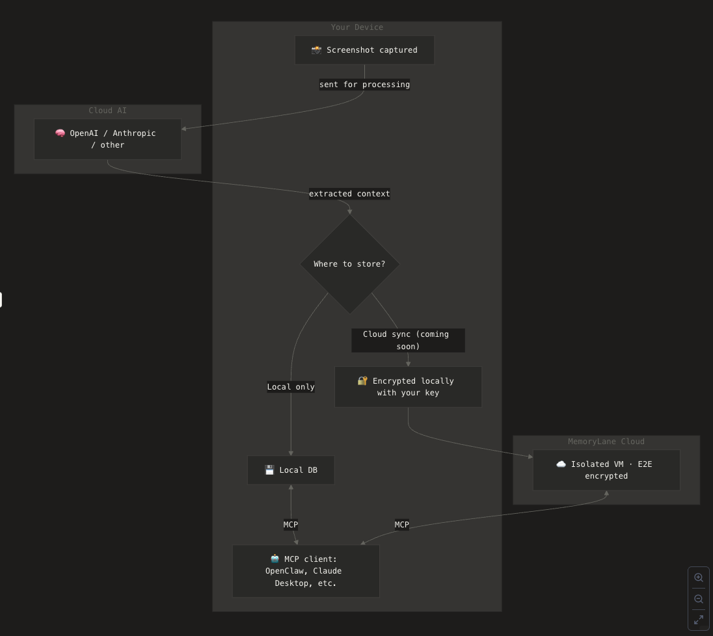

# MemoryLane

## TL;DR

Desktop app that sees what you see, stores summaries about it locally and lets you query it in any AI chat via MCP.

**Screenshots → local storage → MCP into AI chats**

🎬 [Demo](https://www.loom.com/share/513b213e82d14323999e419fa434576d)

## About

### Problem

AI conversations are full of friction because LLMs have little to no context about their users, forcing people to constantly re-explain the same things.

### Solution

Always-on desktop app that analyzes screenshots of what you do, extracts and summarizes it with a vision model and stores it locally on your device. It then lets you pull it into your favorite LLM via MCP as rich context.

### Benefit

Make your AI output 10x better by giving it 10x more context about you.

### Why we built it

To solve our own problem and because it's become clear that context is the key to truly benefiting from AI. We couldn't find anything similar that would be good enough.

### Security

MemoryLane uses screenshots and parses them using cloud vision models to generate textual data summaries. Those summaries are stored locally on your device and pulled into your AI chats via MCP on demand. Screenshots are not stored.

### Why we use cloud AI models

There are two reasons we didn't use local AI models.

**First, performance.** Local models are too big (~4GB). We believe most users appreciate speed and normal battery life more than having half of their RAM eaten up by an "invisible" app that turns their laptops into "[toasters](https://kevinchen.co/blog/rewind-ai-app-teardown/)". You can't yet do this with local AI models.

**Second, quality.** Cloud models perform 10x better than local ones. Local models are great for a nice demo but fall short off the mark when users expect good output.

That said, we'd love to see someone prove us wrong. It's why we open sourced it.

## Example queries

- "pick up where I left off working on ____"
- "summarize my research on ____ from last week"
- "list the design frameworks I viewed recently"

## How it works

1. App captures screenshots using various triggers (e.g. typing session) and time intervals
2. Vision model extracts context
3. Output is stored locally in SQLite (never leaves your device)
4. You can query via MCP in Cursor, Claude, ChatGPT, etc.

### Architecture

## Quick start

There are two ways to start using MemoryLane.

### (1) Download our macOS app

1. Go to https://trymemorylane.com/
2. Click "Download"
3. Install the app
4. Enable permissions
5. Enable MCP configuration
6. Done!

### (2) Build using npm

1. Clone this repo
2. ….

## Requirements

- macOS (ARM64)
- OpenRouter API key

## Privacy

- Screenshots are processed, then deleted (never stored)
- Only textual summaries of your activity are stored (locally, hosted solution coming soon)
- Nothing leaves your device except for the initial screenshot that's parsed by a vision model (Mistral by default because it's got default Zero Data Retention policy)

## Limitations

There are a few limitations we're aware of and working to resolve.

1. **Working with two screens** — our app currently captures content from one screen only; multi-monitor support is coming soon ([#4](https://github.com/deusXmachina-dev/memorylane/issues/4))
2. **Pending Apple notarization** — the app is code-signed and is currently awaiting Apple notarization (expected by Feb 14th); for now, you'll need to right-click → Open on first launch to bypass Gatekeeper ([#5](https://github.com/deusXmachina-dev/memorylane/issues/5))
3. **macOS ARM64 only** — this release includes a macOS Apple Silicon DMG only; Intel Mac, Windows, and Linux builds will be supported in the future
