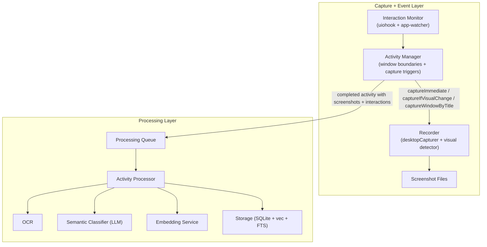
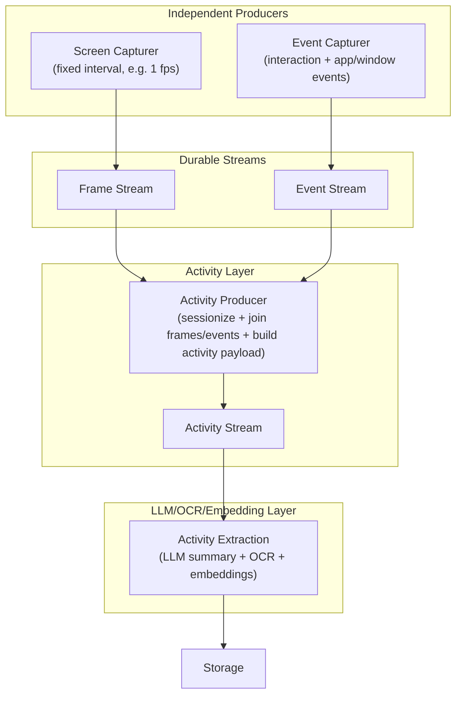
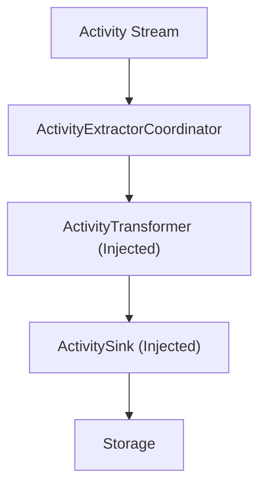

# MemoryLane Architecture Diagram

This diagram captures:

- **Current pipeline** (what runs today)
- **Target timeline-first pipeline** (based on your design direction)

## Current (Today)

## Target (Timeline-First)

## Target Extraction Detail

### Component Responsibilities

- `ActivityExtractorCoordinator`: orchestrates extraction for each activity from the stream.
- `ActivityTransformer` (injected dependency): maps `V2Activity` to storage-ready extracted data.
- `ActivitySink` (injected dependency): persists extracted data to storage.
- In tests, inject fake transformer/sink implementations to validate coordinator behavior without real LLM/OCR.

## Why the target split helps

- Producers are simple and testable in isolation.
- Activity logic is centralized in one producer, which is easier to reason about.
- Activity extraction is downstream-only and independent of capture/sessionization internals.
- Regression tests can replay streams deterministically.
- Extraction can be tested without LLM calls by injecting transformer/sink dependencies.
